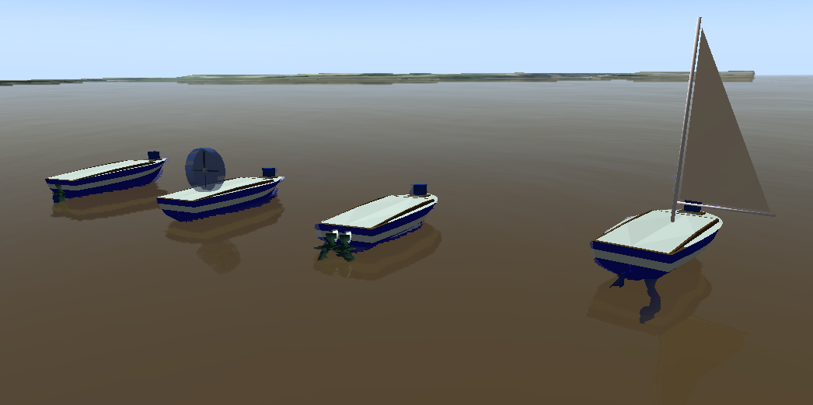
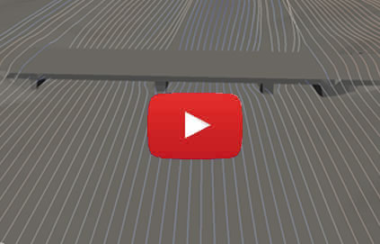
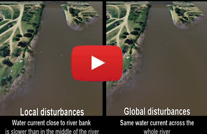

# Simulated enviroment for Unmanned Surface Vehicles (usv_sim_lsa) -- 0.2


[](https://travis-ci.org/disaster-robotics-proalertas/usv_sim_lsa)
[](http://gazebo-usv-simulation.rtfd.io/)
[](https://gitter.im/usv-sim)
[](https://zenodo.org/badge/latestdoi/91500138)
[](https://github.com/disaster-robotics-proalertas/usv_sim_lsa/blob/master/LICENSE)

This simulator uses a combination of multiple physics packages to build a test environment for Unmanned Surface Vehicles (USV).  We'll use it, at first, to develop and test control and trajectory strategies for USVs. but it can be easily adapted to other applications. It contains multiple robot models such as propeled boats(rudder boat, differential boat, airboat) and sailboat.
Boats are affected by waves, wind and water currents. To do that, we curently use UWsim for water surface modeling, we also load HEC-RAS output files with water speed of river and channel simulations. We simulate wind current with OpenFoam simulator. All those features alow to disturb the movement of boats in a realistic way.

## Prerequisites

You need Ubuntu Linux 16.04 since the current version of this simulator uses ROS Kinetic. To install ROS Kinetic and some additional packages, run the following commands:


        sudo sh -c 'echo "deb http://packages.ros.org/ros/ubuntu $(lsb_release -sc) main" > /etc/apt/sources.list.d/ros-latest.list'
        sudo apt-key adv --keyserver 'hkp://keyserver.ubuntu.com:80' --recv-key C1CF6E31E6BADE8868B172B4F42ED6FBAB17C654
        sudo apt-get update
        sudo apt-get install ros-kinetic-desktop-full ros-kinetic-control-* ros-kinetic-osg-markers ros-kinetic-move-base -y
        sudo rosdep init
        rosdep update
        sudo echo "source /opt/ros/kinetic/setup.bash" >> ~/.bashrc
        source ~/.bashrc

Now run the following commands to download the dependencies of usv_sim:

        sudo apt-get install python-rosinstall python-rosinstall-generator python-wstool build-essential python-rosdep python-wxtools python-lxml python-pathlib python-h5py python-scipy python-geolinks python-gdal -y
        sudo apt-get install libfftw3-* libxml++2.6-* libsdl-image1.2-dev libsdl-dev -y


## Installing

To run the packages of usv_sim you need a catkin workspace. If you already have a workspace you may jump to the Downloading and installing subsection.

### Creating a catkin workspace

        source /opt/ros/kinetic/setup.bash
        mkdir -p ~/catkin_ws/src
        cd ~/catkin_ws/
        catkin_make

### Downloading and installing usv_sim stack

Clone the usv_sim repository in the src folder of your catkin workspace:

        cd ~/catkin_ws/src
        git clone https://github.com/disaster-robotics-proalertas/usv_sim_lsa.git
        cd usv_sim_lsa
        git submodule init
        git submodule update

Run the instalation script:

        cd ~/catkin_ws/src/usv_sim_lsa
        chmod +x ./install_usv_sim 
        ./install_usv_sim

Install the dependencies:

        rosdep install --from-paths src --ignore-src --rosdistro kinetic -y

Compile the stack:

        cd ~/catkin_ws/
        catkin_make_isolated --install
        source install_isolated/setup.bash

To run a scenario:

        roslaunch usv_sim airboat_scenario1.launch parse:=true
        roslaunch usv_sim airboat_scenario1.launch parse:=false

The simulation might take some time to initialize if you're launching gazebo for the first time. If the simulation dosen't starts you should close it, run gazebo separately (command *gazebo* in the terminal), wait for gazebo to open (it is downloading some models), close gazebo and then try to run the scenario again.

Make sure your graphic card driver is up to date.


## Running the tests

On main folder of usv_sim_lsa, there are some scripts that run testing scenarios on Diluvio's River in Porto Alegre, Brazil. Each scenario is configured to test the boat control on executing some common maneuveurs (see image below). Besides that, you can run the following scripts:
- ``scenario1``: boat should navigate through two lines of buoys. 
- ``scenario2``: boat should avoid colision with 3 buoys.
- ``scenario3``: boat should execute zigzag to cover an area.

To execute water simulation to those scenarios, you should run the script named ``waterCurrentDiluvio``.

<p align="center">
  
</p>

[//]: # ( AMA, aponta aqui para aqueles videos que vc fez antes. la no youtube, seria bom vc editar a descricao dos videos para incluir uma frase sobre o simulador e apontar p esse repo. assim, quem achar o teu simulador via youtube vai conseguir acessar o codigo )


## System Architecture 

The main system architecture is composed of UWSIM and Gazebo. With some plugins, we can simulate in a realistic way the effects of waves, wind and water currents on several boat types. Above is presented the some topic interaction between our gazebo plugin named usv_sailing_plugin and ROS Nodes wind_current and wind_current.


<p align="center">
  
</p>

## Models


There are 4 boat models preconfigured in package usv_sim:
- airboat: composed by one thruster above the hull. This model has greater advantaged to navigate on shallow waters.
- differential boat: two thruster under water surface. This model has the simplest maneuverability.
- rudder boat: one thruster and one rudder. One of the most common configuration presented in boats.
- sailboat: one sail and one rudder.

<p align="center">
  
</p>

The hull of all models above has been subdivided in 6 parts (see image above), so waves affects buoyancy of model in such way that boats present more realistic movement. If you want greater realism, you can subdivided the hull in more parts. To do that, you have to use geometric tools like Blender to model each part of hull. After that, you should configure links and joints in xacro files (like usv_sim/xacro/boat_subdivided4.xacro). As gazebo simulator combine fixed joints, you should define the joints of hull as of type revolution, but with zero value to upper and lower limits. 

<p align="center">
  
</p>


## DISTURBANCE TYPES
The vehicles can be affected by 3 types of disturbances: wind currents, water currents and waves. Each kind of disturbance is presented below:

### WATER CURRENT
To allow the water current affect vehicles differently across the space and time, the USV_SIM can load output simulations from the HEC-RAS hydrological simulator. The HEC-RAS is a CFD software (computational fluid dynamics) capable of modelling the water flow through natural rivers and channels. Below it is presented an image, and a video of HEC-RAS simulations used in USV_SIM. HEC-RAS can reproduce turbulence effects presented into rivers and other bodies of water.

<p align="center">
  
</p>

#### VIDEO - CLICK ON IMAGE TO PLAY IT
<p align="center">
<a href="http://www.youtube.com/watch?feature=player_embedded&v=mbg59MQRa9M" target="_blank">
  
</a>
</p>

### WAVES
The integration with UWSim allows to reproduce waves to different configurations. Below is presented an differential boat travelling through waves.

[//]: # (This is also a comment. AMA. Marcelo, seria legal colocar um video mostrando bem de perto um barco balançando com as ondas.)


### WIND CURRENTS

The simulator can load wind currents generated by the CFD software OpenFoam, which it can solve continuum mechanics problems, and reproduce vortices and wind turbulence near buildings. Below it is presented some simulations that are avaliable in our robotic simulator. 

<p align="center">
  
  
</p>
<p align="center">
          
          
</p>
P.S: The lines on the botton images have been integrated with runge kutta from wind current field.

#### VIDEO - CLICK ON IMAGE TO PLAY IT
<p align="center">
<a href="http://www.youtube.com/watch?feature=player_embedded&v=i6lvMAsERHg" target="_blank">
  
</a>
</p>

### HOW DISTURBANCES CAN AFFECT VEHICLES
The disturbances can affect vehicles in different ways:
- **NONE:** vehicle will not be affected by the disturbance;
- **GLOBAL:** vehicle will be affected by a global disturbance. It will not change in time and in space (same value to all over the place);
- **LOCAL:** vehicle will be affected by a local disturbance. It can change in time and in space. Disturbance values will acquired from wind_current (OpenFoam Simulation) and water_current (HEC-RAS Simulation);
#### CONFIGURATION

You can configure how the wind current and how the water current will affect each vehicle. Thus you can define on ''windType'' and ''waterType'' parameter one of the following options: ''none'', ''global'', ''local''.

Below it is presented the portion of a launch file that it responsible to configure an airboat in the simulation. In this case, the ''windType'' and ''waterType'' was configurated with value ''local''. 
```
        <include file="$(find usv_sim)/launch/models/spawn_airboat_validation.launch">
                <arg name="gui" value="$(arg gui)"/>
                <arg name="spawnGazebo" value="$(arg spawnGazebo)"/>
                <arg name="namespace" value="$(arg namespace)"/>
                <arg name="windType" value="local"/>
                <arg name="waterType" value="local"/>
        </include>
```

Below, it is present another example, where a differential boat (named ''diffboat1'') was configurated in such way that the wind current has a global value and will not change in time, and the water current was defined to ''none'', so the vehicle will not be affected by wind currents.
```
        <include file="$(find usv_sim)/launch/models/spawn_diffboat_validation.launch">
                <arg name="gui" value="$(arg gui)"/>
                <arg name="spawnGazebo" value="$(arg spawnGazebo)"/>
                <arg name="namespace" value="diffboat1"/>
                <arg name="windType" value="global"/>
                <arg name="waterType" value="none"/>
        </include>
```

#### VIDEOS

###### Differential boats sailing upstream - Global vs Local disturbances

<p>
        <a href="http://www.youtube.com/watch?feature=player_embedded&v=JEhY3h-BKGQ" target="_blank">
                
        </a>
</p>
        

###### Scenario 1

<a href="http://www.youtube.com/watch?feature=player_embedded&v=jvgcgIXkRtQ" target="_blank">
 
</a>
<a href="http://www.youtube.com/watch?feature=player_embedded&v=u-JnylVnD9I" target="_blank">
 
</a>
<a href="http://www.youtube.com/watch?feature=player_embedded&v=QlenP-I_Oms" target="_blank">
 
</a>

###### Scenario 2

<a href="http://www.youtube.com/watch?feature=player_embedded&v=aAN48eRpTSw" target="_blank">
 
</a>
<a href="http://www.youtube.com/watch?feature=player_embedded&v=pb13mWNcg74" target="_blank">
 
</a>
<a href="http://www.youtube.com/watch?feature=player_embedded&v=sTJ3DfIYY_M" target="_blank">
 
</a>

## GROUND TRUTH GENERATION

We have added support to generate ground truth data for algorithm visions. Below we present some result of our solution, you can execute an example by running the following commands:
```
        roslaunch usv_sim airboat_segmentation_2.launch parse:=true
        roslaunch usv_sim airboat_segmentation_2.launch parse:=false
```
As soon as both UWSIM show up, press **c** on your keyboard in each UWSim window, so the boat camera will be rendered.


<p align="center">
  
</p>

[//]: # ((This is also a comment. AMA. Marcelo, nao sei se eh necessario falaar sobre GROUND TRUTH GENERATION no git. mais eh instalacao, como rodar exemplo, como modificar o controle, como parametrizar a simulacao, como criar um scenario, etc. coisas de usabilidade.)

## Contributing

One can contribute to this project by deteting bugs, future features, and pull requests. 

## Versioning

v0.0.1 – Initial version submitted to IROS 2018

v0.2 - Version submitted to Sensors 

## Reference for citing USV_SIM

Paravisi, M.; H. Santos, D.; Jorge, V.; Heck, G.; Gonçalves, L. M.; Amory, A.; Unmanned Surface Vehicle Simulator with Realistic Environmental Disturbances; Journal Sensors, Volume 19, 2019. Available: <a href="http://www.mdpi.com/1424-8220/19/5/1068" target="_blank">http://www.mdpi.com/1424-8220/19/5/1068</a>

## Authors

* Alexandre Amory (PUCRS University, Porto Alegre, Brazil)
* Davi Henrique (UFRN University, Natal, Brazil)
* Luiz Marcos Gonçalves (UFRN University, Natal, Brazil)
* Marcelo Paravisi (IFRS, Osorio, Brazil; PUCRS University, Porto Alegre, Brazil)
* Vitor Augusto Machado Jorge (PUCRS University, Porto Alegre, Brazil)
## License

USV Simulator is open-sourced under the Apache-2.0 license. See the
[LICENSE](LICENSE) file for details.

## Acknowledgments

* freefloating_gazebo
* LiftDrag 
* UWsim - https://github.com/uji-ros-pkg/underwater_simulation
* Openfoam - https://openfoam.org/
* HEC-RAS - https://en.wikipedia.org/wiki/HEC-RAS 
* CAPES proalertas - https://lsa-pucrs.github.io/projects/pro-alertas

