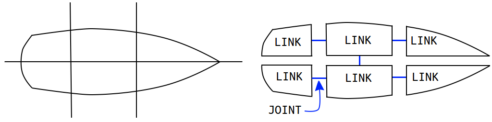
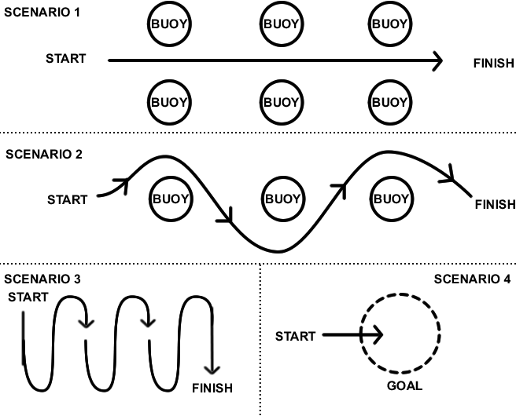
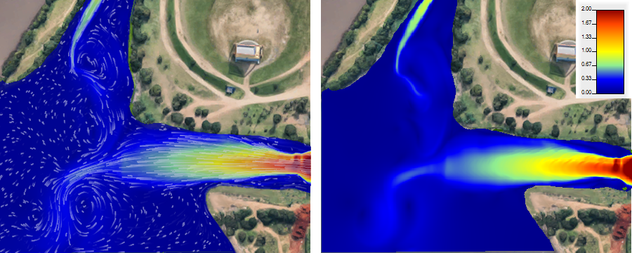
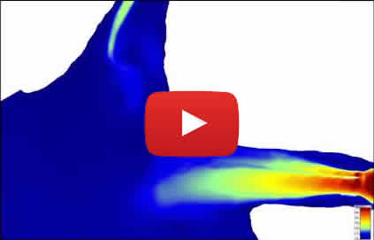
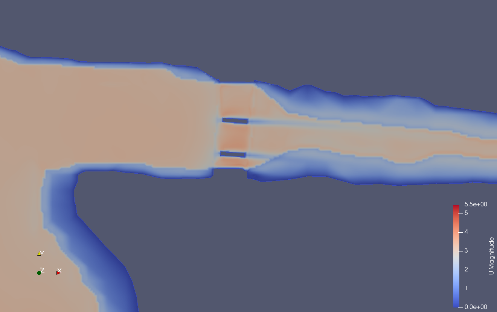
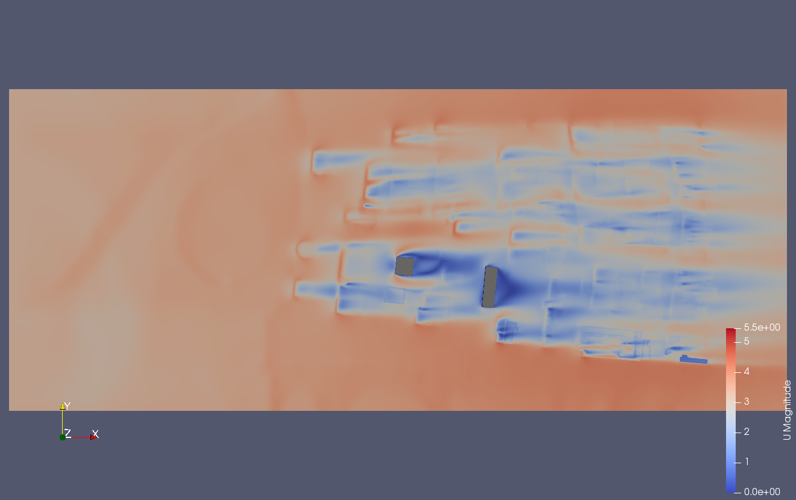
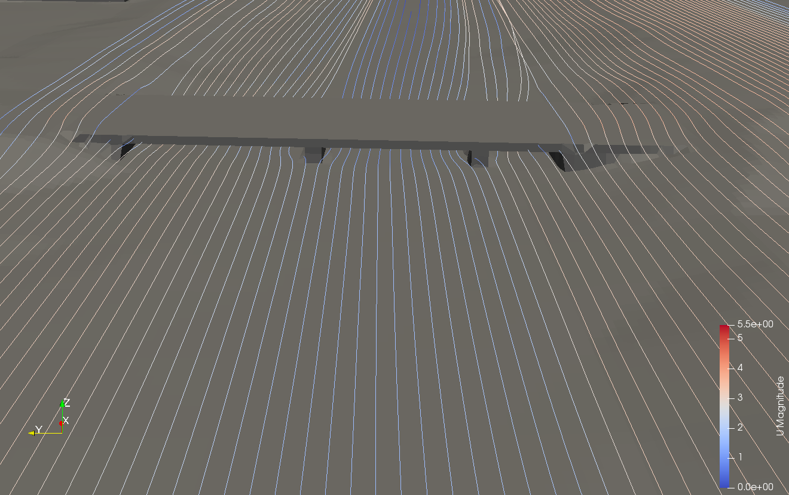
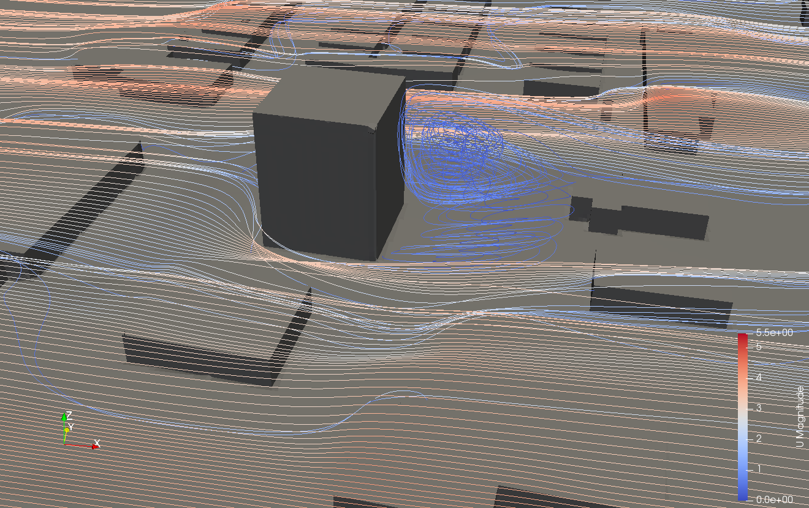
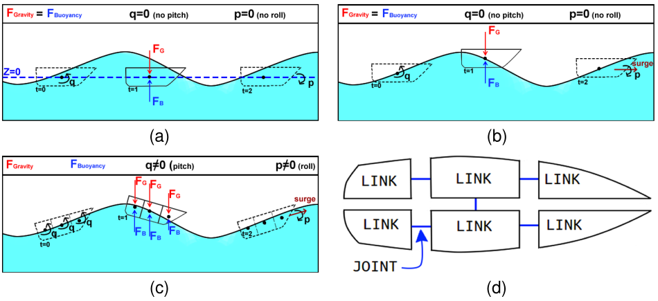

# Simulated enviroment for Unmanned Surface Vehicles (usv_sim_lsa) -- v0.3

The primary motivation for this simulator is to provide a testbed where designers can test Unmanned Surface Vehicle (USV) navigation and control methods in a scenario closer to what might be found in a disaster scenario, where winds, current and waves can play a big impact in the USV mission performance.

This simulator uses a combination of multiple physics packages to build a test environment for USVs.  We'll use it, at first, to develop and test control and trajectory strategies for USVs. but it can be easily adapted to other applications (e.g. for drones or underwater vehicles). It contains multiple robot models such as propeled boats (rudder boat, differential boat, airboat) and a sailboat. The boats are affected by waves, wind and water currents. To do that, we curently use UWsim for water surface modeling, we also load [HEC-RAS](https://www.hec.usace.army.mil/software/hec-ras/) output files with water speed of river and channel simulations. We simulate wind current with [OpenFoam](https://openfoam.org/) simulator. All those features alow to disturb the movement of boats in a realistic way.

Please refer to the [main documentation](./docs/getting_started.md) for installation and testing. 

## Boat Models

There are 4 boat models preconfigured in package usv_sim:
- airboat: composed by one thruster above the hull. This model has greater advantaged to navigate on shallow waters.
- differential boat: two thruster under water surface. This model has the simplest maneuverability.
- rudder boat: one thruster and one rudder. One of the most common configuration presented in boats.
- sailboat: one sail and one rudder.

  

The hull of all models above have been subdivided in 6 parts (see image above), so waves affects buoyancy of model in such way that boats present more realistic movement. If you want greater realism, you can subdivided the hull in more parts. To do that, you have to use geometric tools like Blender to model each part of hull. After that, you should configure links and joints in xacro files (like usv_sim/xacro/boat_subdivided4.xacro). As gazebo simulator combine fixed joints, you should define the joints of hull as of type revolution, but with zero value to upper and lower limits. 

  

## Existing simulation scenarios

On the main folder of usv_sim_lsa, there are some scripts that run testing scenarios on [Diluvio's River in Porto Alegre, Brazil](https://www.google.com.br/maps/@-30.0488882,-51.2294098,16z?entry=ttu). Each scenario is configured to test the boat control on executing some common maneuveurs (see image below). Besides that, you can run the following scripts:
- ``scenario1``: boat should navigate through two lines of buoys. 
- ``scenario2``: boat should avoid colision with 3 buoys.
- ``scenario3``: boat should execute zigzag to cover an area.
- ``scenario4``: boat should remain within assigned region, despite the environment disturbances.

To execute water simulation to those scenarios, you should run the script named ``waterCurrentDiluvio``.

  

## Enrironmental disturbance types

The vehicles can be affected by 3 types of enrironmental disturbances: wind currents, water currents and waves. Each kind of disturbance is presented below.

### Water current

To allow the water current affect vehicles differently across the space and time, the USV_SIM can load output simulations from the HEC-RAS hydrological simulator. The HEC-RAS is a CFD software (computational fluid dynamics) capable of modelling the water flow through natural rivers and channels. Below it is presented an image, and a video of HEC-RAS simulations used in USV_SIM. HEC-RAS can reproduce turbulence effects presented into rivers and other bodies of water.

  

VIDEO - CLICK ON IMAGE TO PLAY IT
 

### Wind

The simulator can load wind currents generated by the CFD software OpenFoam, which it can solve continuum mechanics problems, and reproduce vortices and wind turbulence near, for example, bridges or buildings. Below it is presented some simulations that are avaliable in our robotic simulator. 

 Example of winds near bridges and buildings

  
  

          
          

P.S: The lines on the botton images have been integrated with [runge kutta](https://en.wikipedia.org/wiki/Runge%E2%80%93Kutta_methods) from wind current field.

VIDEO - CLICK ON IMAGE TO PLAY IT
 

### Waves and buoyance model

The integration with UWSim allows to reproduce waves to different configurations. Below is presented an differential boat travelling through waves. The following figure shows a simulation model with no how buoyance (a), a simplified buoyance model (b), and how it was implemented in usv_sim (c), providing more realism.

          

## Contributing

One can contribute to this project by deteting bugs, future features, and pull requests. 

## Versioning

 - v0.3 - Adding docker image and improved documentation 
 - v0.2 - Version submitted to Sensors 
 - v0.0.1 – Initial version submitted to IROS 2018

## Reference for citing USV_SIM

 - Paravisi, M.; H. Santos, D.; Jorge, V.; Heck, G.; Gonçalves, L. M.; Amory, A.; Unmanned Surface Vehicle Simulator with Realistic Environmental Disturbances; Journal Sensors, Volume 19, 2019. Available: [http://www.mdpi.com/1424-8220/19/5/1068](http://www.mdpi.com/1424-8220/19/5/1068).

## Other references

 - Jorge, V.A.M.; Granada, R.; Maidana, R.G.; Jurak, D.A.; Heck, G.; Negreiros, A.P.F.; dos Santos, D.H.; Gonçalves, L.M.G.; Amory, A.M. A Survey on Unmanned Surface Vehicles for Disaster Robotics: Main Challenges and Directions. Sensors 2019, 19, 702. Available: [https://www.mdpi.com/1424-8220/19/3/702](https://www.mdpi.com/1424-8220/19/3/702).
 - Marcelo's [PhD thesis](https://tede2.pucrs.br/tede2/handle/tede/5141) (in Portuguese).

## Authors

* Alexandre Amory (PUCRS University, Porto Alegre, Brazil)
* Davi Henrique (UFRN University, Natal, Brazil)
* Luiz Marcos Gonçalves (UFRN University, Natal, Brazil)
* Marcelo Paravisi (IFRS, Osorio, Brazil; PUCRS University, Porto Alegre, Brazil)
* Vitor Augusto Machado Jorge (PUCRS University, Porto Alegre, Brazil)

## License

USV Simulator is open-sourced under the Apache-2.0 license. See the
[LICENSE](LICENSE) file for details.

## Acknowledgments

* freefloating_gazebo
* LiftDrag 
* UWsim - https://github.com/uji-ros-pkg/underwater_simulation
* Openfoam - https://openfoam.org/
* HEC-RAS - https://en.wikipedia.org/wiki/HEC-RAS 
* CAPES proalertas - https://lsa-pucrs.github.io/projects/pro-alertas

