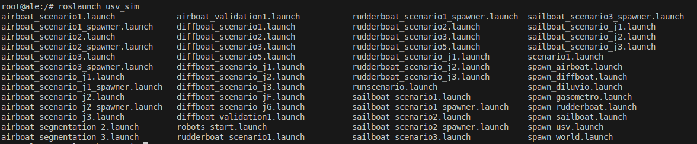
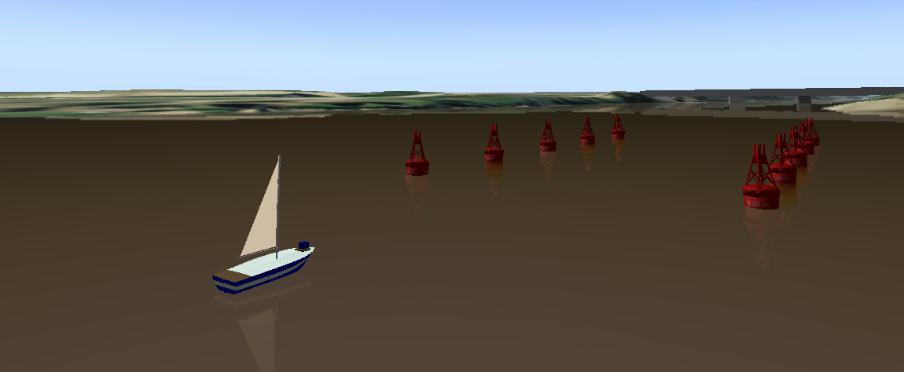

# Additional simulation scenarios

There are several simulation scenarios, described in launch files. They are a combination of all 4 boat models (differential, rudder, airboat, sailboat) with the scenarios 1 to 4. The easiest way to check the available models is to type `roslauch usv_sim` and then press Tab. It will show a list with all available launch files.

<p align="center">
  
</p>

To run a lauch file for the first time, it's necessary to run `roslaunch usv_sim <scenario_name>.launch parse:=true`, with the `parse:=true` argument. This command will generate other launch files used by the actual command, which uses `parse:=false`. 

```bash
roslaunch usv_sim sailboat_scenario1.launch parse:=true
roslaunch usv_sim sailboat_scenario1.launch parse:=false
```

It will launch this simulation scenario.

<p align="center">
  
</p>
