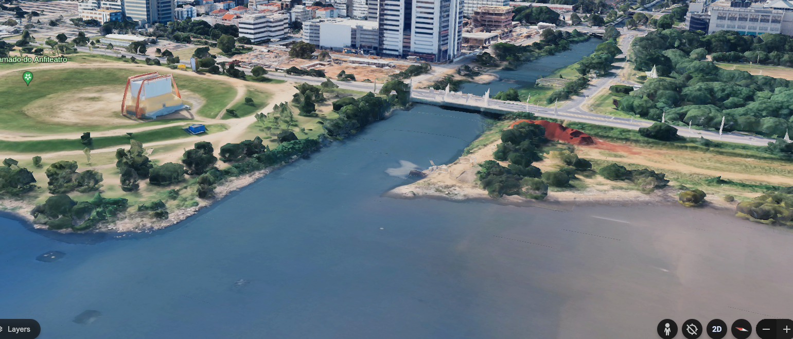

.. _environments:

# Environments

The main environment in the simulation scenarios was built from MDT e MDS maps from [Porto Alegre](https://earth.google.com/web/search/porto+alegre/@-30.04697237,-51.23364181,7.55273003a,359.88352209d,35y,61.69414322h,74.06636323t,0r/data=CigiJgokCbmS1_TIBTRAEbeS1_TIBTTAGRzmghpViUNAIcJWwCQsLU_AOgMKATA), in a region very prone to floodings. Coordinates GPS 30°02'50.5"S 51°13'57.7"W.

 UWSIM and Google Earth view of the Diluvio River, Porto Alegre, RS - Brazil

  
  

The models includes the end of the Diluvio river, including its very last bridge. 

May 2024, this very same region was affected its worst flooding ever
  - https://edition.cnn.com/2024/05/08/weather/brazil-flooding-satellite-imagery-intl/index.html
  - https://www.washingtonpost.com/world/interactive/2024/brazil-flood-porto-alegre-photos/
  - https://www.reuters.com/pictures/stunning-aerial-photos-show-devastating-scale-flooding-brazil-2024-05-19/IARYNJYAO5NCJEYCIZP3PIBHOM/
  - https://www.yahoo.com/news/aerial-images-show-devastation-deadly-174903321.html

