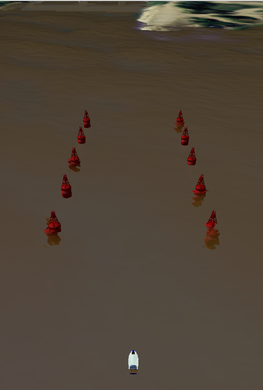

# Getting Started


## Depedencies and Compilation

We describe two installation procedures: 
 - [Legacy install](./install_legacy.md): the original install procedure which requires and old 16.04 Ubuntu (**Not Recommended**)
 - [Docker-based install](./install_docker.md): relies of docker to create a container with all the dependecies (**Highly Recommended**)

## First tests

The rest of the documentation assumes you are using docker-based install. Let us also assume this basic scenario is launched from a docker terminal:

```bash
roslaunch usv_sim airboat_scenario1.launch parse:=true
roslaunch usv_sim airboat_scenario1.launch parse:=false
```

The UWSIM window shows a scenario like this one, with the boat static. Next, let's investigate the boat's topics and learn how to interact and send commands to it.

<p align="center">
  
</p>


## Interacting with the simulation

Assuming the previous docker image and the simulation scenario are still opened, open a second docker terminal attached to the same image, name `usv_sim_test`. This terminal will be used to launch RViz to send simulation commands:

```bash
docker docker exec -it usv_sim_test bash
```
Within the docker terminal, run: 

```bash
source ~/catkin_ws/install_isolated/setup.bash
roslaunch usv_sim_rviz navigation_rviz.launch
```

| :exclamation:  TBD: How to send the boat to a goal ?  |
|-------------------------------------------------------|

You can also inspect all boat topics to interact with it

```bash
root@ale:~/catkin_ws# rostopic list 
/airboat/Surface/fwd
/airboat/controllers/fwd_joint/position/parameter_descriptions
/airboat/controllers/fwd_joint/position/parameter_updates
/airboat/controllers/fwd_joint/velocity/parameter_descriptions
/airboat/controllers/fwd_joint/velocity/parameter_updates
/airboat/joint_command
/airboat/joint_setpoint
/airboat/joint_states
/airboat/move_usv/goal
/airboat/move_usv/result
/airboat/state
/airboat/thruster_command
/airboat/thruster_use
/clock
/gazebo/current
/gazebo/link_states
/gazebo/model_states
/gazebo/parameter_descriptions
/gazebo/parameter_updates
/gazebo/set_link_state
/gazebo/set_model_state
/gazebo_gui/parameter_descriptions
/gazebo_gui/parameter_updates
/model/state
/rosout
/rosout_agg
/scan
/tf
/tf_static
/uwsim_marker/update
/uwsim_marker/update_full
```

## What's Next ?!?!

Fell free to explore the [additional scenarios](./additional_scenarios.md).
