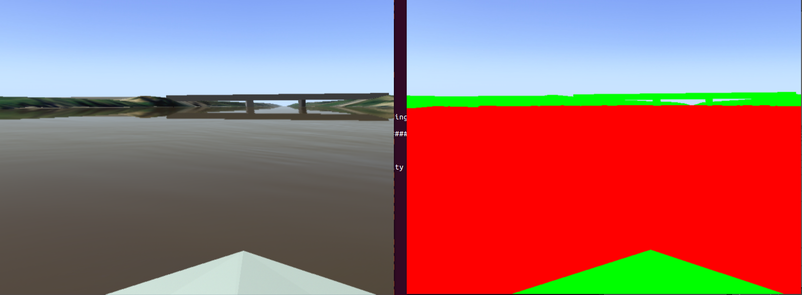

## GROUND TRUTH GENERATION

We have added support to generate ground truth data for computer vision algorithms (e.g. collision avoidance). Below we present some result of our solution, you can execute an example by running the following commands:
```bash
        roslaunch usv_sim airboat_segmentation_2.launch parse:=true
        roslaunch usv_sim airboat_segmentation_2.launch parse:=false
```
As soon as both UWSIM show up, press **c** on your keyboard in each UWSim window, so the boat camera will be rendered.

<p align="center">
  
</p>

[//]: # ((This is also a comment. AMA. Marcelo, nao sei se eh necessario falaar sobre GROUND TRUTH GENERATION no git. mais eh instalacao, como rodar exemplo, como modificar o controle, como parametrizar a simulacao, como criar um scenario, etc. coisas de usabilidade.)