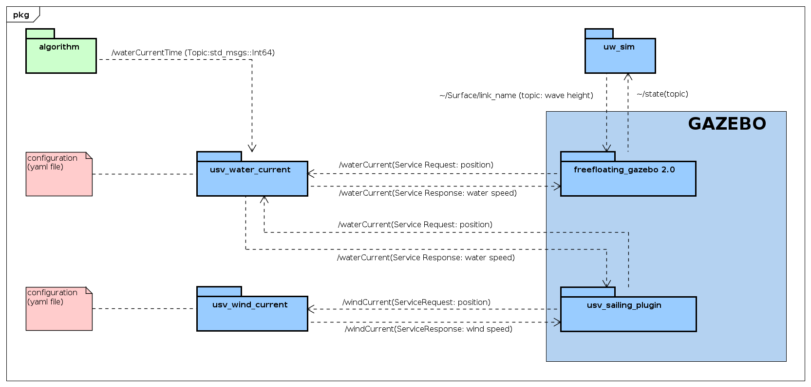

## System Architecture 

The main system architecture is composed of UWSIM and Gazebo. With some plugins, we can simulate in a realistic way the effects of waves, wind and water currents on several boat types. The next figure presents the some topic interaction between our gazebo plugin named `usv_sailing_plugin` and ROS Nodes `wind_current` and `wind_current`.

  

